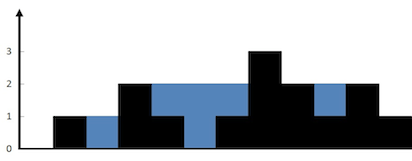

本文中介绍些数组相关的高频算法题，LeetCode 实战分享。

<!--more-->


## 俄罗斯套娃信封问题
 [【LeetCode 直通车】：354 俄罗斯套娃信封问题（困难）](https://leetcode-cn.com/problems/russian-doll-envelopes)

```js
给定一些标记了宽度和高度的信封，宽度和高度以整数对形式 (w, h) 出现。当另一个信封的宽度和高度都比这个信封大的时候，
这个信封就可以放进另一个信封里，如同俄罗斯套娃一样。
请计算最多能有多少个信封能组成一组“俄罗斯套娃”信封（即可以把一个信封放到另一个信封里面）。
说明: 不允许旋转信封。

示例 1：
输入：envelopes = [[5,4],[6,4],[6,7],[2,3]]
输出：3
解释：最多信封的个数为 3, 组合为: [2,3] => [5,4] => [6,7]。

示例 2：
输入：envelopes = [[1,1],[1,1],[1,1]]
输出：1
``` 
    
### 排序+最长上升子序列
```js

var maxEnvelopes = function(envelopes) {
    if (envelopes.length === 1) return 1;
    envelopes.sort((a, b) => {
        if (a[0] !== b[0]) return a[0] - b[0];
        else return b[1] - a[1];
    });
    let LISArr = [];
    for (let [key, value] of envelopes) {
        LISArr.push(value);
    }
    console.log( LISArr);
    return LIS(LISArr);
};
// w: 2 -> 3 -> 4 -> 4 -> 5 -> 6
// h: 4 -> 2 -> 2 -> 3 -> 6 -> 5
// [最长上升子序列](https://www.geekxh.com/1.2.动态规划系列/203.html#_01、题目分析)
function LIS(arr) {
    let dp = [];  // dp[i]表示以arr[i]结尾的最长递增子序列
    let maxAns = 0;
    for (let i = 0; i < arr.length; i++) {
        dp[i] = 1;
    }
    for (let i = 1; i < arr.length; i++) {
        for (let j = i; j >= 0; j--) {
            if (arr[i] > arr[j]) {
                dp[i] = Math.max(dp[i], dp[j] + 1)
            }
            maxAns = Math.max(maxAns, dp[i]);
        }
    }
    return maxAns;
}
```
    
## 最长连续递增序列
[【LeetCode 直通车】：674 最长连续递增序列（简单）](https://leetcode-cn.com/problems/longest-continuous-increasing-subsequence)
    
```js
给定一个未经排序的整数数组，找到最长且 连续递增的子序列，并返回该序列的长度。

连续递增的子序列 可以由两个下标 l 和 r（l < r）确定，如果对于每个 l <= i < r，都有 nums[i] < nums[i + 1] ，     
那么子序列 [nums[l], nums[l + 1], ..., nums[r - 1], nums[r]] 就是连续递增子序列。

示例 1：
输入：nums = [1,3,5,4,7]
输出：3
解释：最长连续递增序列是 [1,3,5], 长度为3。
尽管 [1,3,5,7] 也是升序的子序列, 但它不是连续的，因为 5 和 7 在原数组里被 4 隔开。
```
### 快慢指针
```js
/**
* @param {number[]} nums
* @return {number}
*/
var findLengthOfLCIS = function(nums) {
    if (nums.length === 0) return 0;
    const n = nums.length;
    let left = 0, right = 1;
    let globalMaxLen = 1, maxLen = 1;
    while (right < n) {
        if (nums[right] > nums[left]) maxLen++;
        else {
            maxLen = 1;
        }
        left++;
        right++;
        globalMaxLen = Math.max(globalMaxLen, maxLen);
    }
    return globalMaxLen;
};
```
### 动态规划解法
与最长子序列相比多了个连续，也正是多了这个连续得：不用再遍历之前的取最大值了，只比较前面一个就行，也就变成了纸哟一轮循环即可解决问题。
```js
var findLengthOfLCISCIS = function (nums) {
    if (nums.length === 0) return;
    console.log(nums.length)
    let result=1;
    let dp = [];
    for (let i = 0; i < nums.length; i++) {
        dp[i] = 1;
    }
    for (let i = 0; i < nums.length - 1; i++) {
        if (nums[i + 1] > nums[i]) { // 连续记录
            dp[i + 1] = dp[i] + 1;
        }
        if (dp[i + 1] > result) 
            result = dp[i + 1];
    }
    return result;
}
```
    
## 最长连续序列 
[【LeetCode 直通车】：128 最长连续序列（困难）](https://leetcode-cn.com/problems/longest-consecutive-sequence)
    
```js
给定一个未排序的整数数组 nums ，找出数字连续的最长序列（不要求序列元素在原数组中连续）的长度。
请你设计并实现时间复杂度为 O(n) 的算法解决此问题。
输入：nums = [100,4,200,1,3,2]
输出：4
解释：最长数字连续序列是 [1, 2, 3, 4]。它的长度为 4。
```
查找是否连续，即查找 +1 或 -1 是否存在，查找用哈希   
双层循环的查找可以解决问题，但是时间复杂度 n^2    
优化：尽可能从最小值开始找，怎么尽可能，存在 -1 的数，肯定不是最小。   
### 哈希表
```js
/**
* @param {number[]} nums
* @return {number}
*/
var longestConsecutive = function(nums) {
    if (nums.length === 0) return 0;
    const set = new Set(nums);
    const n = nums.length;
    let globalLongest = 1;
    for (let i = 0; i < n; i++) {
        if (!set.has(nums[i] - 1)) {
            let longest = 1;
            let currentNum = nums[i];
            while (set.has(currentNum + 1)) {
                currentNum += 1;
                longest++;
            }
            globalLongest = Math.max(globalLongest, longest);
        }
    }
    return globalLongest;
};
```
    

---

## 盛最多水的容器
[【LeetCode 11】： 盛最多水的容器（中等）](https://leetcode-cn.com/problems/container-with-most-water/)     
给定一个长度为 n 的整数数组 height 。有 n 条垂线，第 i 条线的两个端点是 (i, 0) 和 (i, height[i]) 。    
找出其中的两条线，使得它们与 x 轴共同构成的容器可以容纳最多的水。    
返回容器可以储存的最大水量。 说明：你不能倾斜容器。    

```js
示例 1 如上图
输入：[1,8,6,2,5,4,8,3,7]
输出：49 
解释：图中垂直线代表输入数组 [1,8,6,2,5,4,8,3,7]。在此情况下，容器能够容纳水（表示为蓝色部分）的最大值为 49。

示例 2：
输入：height = [1,1]
输出：1
```
双循环肯定能借=解，但是肯定不是最优方案
双头往中间走，双层循环变单层循环，走的条件即 放弃短的那个，短的装水少
```js
/**
* @param {number[]} height
* @return {number}
*/
var maxArea = function(height) {
    let n = height.length;
    let left = 0, right = n - 1;
    let maxOpacity = 0;
    while (left < right) {
        let res = Math.min(height[left], height[right]) * (right - left);
        maxOpacity = Math.max(maxOpacity, res);
        if (height[left] < height[right]) left++
        else right--;
    }
    return maxOpacity;
};
```
    
## 寻找两个正序数组的中位数
[LeetCode 4 寻找两个正序数组的中位数（困难）](https://leetcode-cn.com/problems/median-of-two-sorted-arrays)
    
```js
给定两个大小分别为 m 和 n 的正序（从小到大）数组 nums1 和 nums2。请你找出并返回这两个正序数组的 中位数 。
算法的时间复杂度应该为 O(log (m+n)) 。

示例 1：
输入：nums1 = [1,3], nums2 = [2]
输出：2.00000
解释：合并数组 = [1,2,3] ，中位数 2

示例 2：
输入：nums1 = [1,2], nums2 = [3,4]
输出：2.50000
解释：合并数组 = [1,2,3,4] ，中位数 (2 + 3) / 2 = 2.5
```
### 正常合并找中位数
```js
/**
* @param {number[]} nums1
* @param {number[]} nums2
* @return {number}
*/
var findMedianSortedArrays = function(nums1, nums2) {
    let m = nums1.length, n = nums2.length;
    let i = 0, j = 0;
    let newArr = [];
    while (i < m && j < n) {
        if (nums1[i] < nums2[j]) {
            newArr.push(nums1[i++]);
        } else {
            newArr.push(nums2[j++]);
        }
    }
    newArr = newArr.concat(i < m ? nums1.slice(i) : nums2.slice(j));
    const len = newArr.length;
    console.log(newArr)
    if (len % 2 === 0) {
        return (newArr[len / 2] + newArr[len / 2 - 1]) / 2;
    } else {
        return newArr[Math.floor(len / 2)];
    }
};
```
### 二分
中位数，即可理解为第 len/2=k 大或小的数，以第 len/2=k 小为例。    
分别对两个有序数组取 k/2 的值比较大小，小的即淘汰。之后再找第 k-x 小的元素。    
依次循环，直至找到第 1 小即可。注意其中的特例情况。    
```js  
var findMedianSortedArrays = function(nums1, nums2) {
    const len1 = nums1.length;
    const len2 = nums2.length;
    const mid = (len1 + len2 + 1) >> 1;
    const left = getK(nums1, nums2, 0, 0, mid);
    // 判断总长度奇偶
    if ((len1 + len2) % 2) {
        return left; //奇数
    } else {
        const right = getK(nums1, nums2, 0, 0, mid + 1);
        return (left + right) / 2
    }
};

// 取第k小的数
function getK(nums1, nums2, start1, start2, k) {
    const len1 = nums1.length;
    const len2 = nums2.length;
    /* 特例 */
    // nums1 数组的元素排除完
    if (len1 === start1) return nums2[start2 + k - 1];
    if (len2 === start2) return nums1[start1 + k - 1];
    // 排除到只剩两个元素取最小 即剩余元素的最小值
    if (k === 1) return Math.min(nums1[start1], nums2[start2]);

    /* 通常情况 */
    // 取k的一半 同时注意可能会超出数组长度 最多取数组最后一个元素
    const i = start1 + Math.min(len1, k >> 1) - 1;
    const j = start2 + Math.min(len2, k >> 1) - 1;
    // j 前面的所有元素被排除了 同时缩减k的值
    if (nums1[i] > nums2[j]) {
        return getK(nums1, nums2, start1, j + 1, k - (j - start2 + 1));
    } else {
        return getK(nums1, nums2, i + 1, start2, k - (i - start1 + 1));
    }
}
```
    
## 删除有序数组中的重复项
[【LeetCode 26】删除有序数组中的重复项（简单](https://leetcode-cn.com/problems/remove-duplicates-from-sorted-array)

```js
给你一个升序排列的数组 nums，请你原地删除重复出现的元素，使每个元素只出现一次，返回删除后数组的新长度。元素的相对顺序应该保持一致。
由于在某些语言中不能改变数组的长度，所以必须将结果放在数组nums的第一部分。更规范地说，如果在删除重复项之后有 k 个元素，那么 nums 
的前 k 个元素应该保存最终结果。将最终结果插入 nums 的前 k 个位置后返回 k 。
不要使用额外的空间，你必须在 原地 修改输入数组 并在使用 O(1) 额外空间的条件下完成。

示例 1:
给定数组 nums = [1,1,2], 
函数应该返回新的长度 2, 并且原数组 nums 的前两个元素被修改为 1, 2。 
你不需要考虑数组中超出新长度后面的元素。

示例 2:
给定 nums = [0,0,1,1,1,2,2,3,3,4],
函数应该返回新的长度 5, 并且原数组 nums 的前五个元素被修改为 0, 1, 2, 3, 4。
你不需要考虑数组中超出新长度后面的元素。
```
### 快慢指针
```cpp
/**
* @param {number[]} nums
* @return {number}
*/
var removeDuplicates = function(nums) {
    if (nums.length <= 1) return nums.length;
    let lo = 0, hi = 0;
    while (hi < nums.length) {
        while (nums[lo] === nums[hi] && hi < nums.length) hi++;
        if (nums[lo] !== nums[hi] && hi < nums.length) {
                lo++;
                nums[lo] = nums[hi];
        }
        hi++;
    }
    return lo + 1;
};
```
    
## 和为K的子数组
[【LeetCode 560】：和为K的子数组（中等）](https://leetcode-cn.com/problems/subarray-sum-equals-k)
```js
给你一个整数数组 nums 和一个整数 k ，请你统计并返回 该数组中和为 k 的`连续子数组`的个数 。


示例 1：
输入：nums = [1,1,1], k = 2
输出：2

示例 2：
输入：nums = [1,2,3], k = 3
输出：2
```
### 暴力循环
针对所有情况的子数组首尾位置，计算其中元素之和，看是否等于 k，但是这里面存在着大量的重复计算，时间复杂度是O(n^2)

### 单循环
其实也可以事先计算出到每个位置的元素和sum，那子数组 nums[i:j]=(nums[0]+nums[1]+ ··· +nums[j]) - (nums[0]+nums[1]+ ··· +nums[i-1])=sum[j]-sum[i-1]，这样我们用二重循环的方式就可以解决，时间复杂度降到了 O(n) 。

### 哈希表
我们可以用哈希表，我们可以在元素累加的过程中得到 sum[j]=nums[0]+nums[1]+ ··· +nums[j]，并放入哈希表中。如果我们可以在哈希表中发现之前存在着 sum[i] 使得` sum[j]-sum[i]=k`，那么也就说明了有一个子序列之和为 k。时间复杂度终于被降到了  。

当存在多个sum[i]使得sum[j]-sum[i]=k成立时，可以加上对应的数量就行了。注意，需要初始化 hash[0]=1，这样 sum==k 时才能被计数。

```js
/**
* @param {number[]} nums
* @param {number} k
* @return {number}
*/
var subarraySum = function(nums, k) {
    const mp = new Map();
    mp.set(0, 1);
    let count = 0, pre = 0;
    for (const x of nums) {
        pre += x;
        if (mp.has(pre - k)) {  // 为什么这样就 count+
            count += mp.get(pre - k); 
        }
        if (mp.has(pre)) {
            mp.set(pre, mp.get(pre) + 1);
        } else {
            mp.set(pre, 1);    map(1:1,0:1)
        }
    }
    return count;
};
```
## nSum问题【哈希表】
### 两数之和
[【LeetCode 直通车】：1 两数之和（简单）](https://leetcode-cn.com/problems/two-sum)

```js
给定一个整数数组 nums 和一个整数目标值 target，请你在该数组中找出和为目标值 target 的那两个整数，并返回它们的数组下标。
你可以假设每种输入只会对应一个答案。但是，数组中同一个元素在答案里不能重复出现。
你可以按任意顺序返回答案。

示例 1：
输入：nums = [2,7,11,15], target = 9
输出：[0,1]
解释：因为 nums[0] + nums[1] == 9 ，返回 [0, 1] 。

示例 2：
输入：nums = [3,2,4], target = 6
输出：[1,2]

示例 3：
输入：nums = [3,3], target = 6
输出：[0,1]
```

```js
var twoSum = function(nums, target) {
    let map2 = new Map();
    for (let i = 0; i < nums.length; i++) {
        map2.set(nums[i], i);
    }
    for (let i = 0; i < nums.length; i++) {
        if (map2.has(target - nums[i]) && map2.get(target - nums[i]) !== i)
            return [i, map2.get(target - nums[i])]
    }
};
```
### 两数之和 II
[【LeetCode 直通车】：167 两数之和 II - 输入有序数组（简单）](https://leetcode-cn.com/problems/two-sum-ii-input-array-is-sorted)

### 三数之和
[【LeetCode 直通车】：15 三数之和（中等）](https://leetcode-cn.com/problems/two-sum-ii-input-array-is-sorted)
```js
给定一个包含 n 个整数的数组 nums，判断 nums 中是否存在三个元素 a，b，c ，使得 a + b + c = 0 ？找出所有满足条件且不重复的三元组。

注意：答案中不可以包含重复的三元组。

例如, 给定数组 nums = [-1, 0, 1, 2, -1, -4]，满足要求的三元组集合为：
[
  [-1, 0, 1],
  [-1, -1, 2]
]
```
### 四数之和
[【LeetCode 直通车】：18 四数之和（中等）](https://leetcode-cn.com/problems/4sum)

```js
题意：给定一个包含 n 个整数的数组 nums 和一个目标值 target，判断 nums 中是否存在四个元素 a，b，c 和 d ，      
使得 a + b + c + d 的值与 target 相等？找出所有满足条件且不重复的四元组。

「注意：」答案中不可以包含重复的四元组。

示例：
给定数组 nums = [1, 0, -1, 0, -2, 2]，和 target = 0。
满足要求的四元组集合为：
[ [-1,  0, 0, 1], [-2, -1, 1, 2], [-2,  0, 0, 2] ]
```
四个数求和，需要四个变量来控制着进行遍历。     
钉死两个，for 循环 i 和 j ，在 while (left < right) ，四个变量。
可以事前排个序来减少一些，不必要的循环。    
```js
var fourSum = function(nums, target) {
    const quadruplets = [];
    if (nums.length < 4) {
        return quadruplets;
    }
    nums.sort((x, y) => x - y);
    const length = nums.length;
    for (let i = 0; i < length - 3; i++) {
        if (i > 0 && nums[i] === nums[i - 1]) {
            continue;
        }
        if (nums[i] + nums[i + 1] + nums[i + 2] + nums[i + 3] > target) {
            break;
        }
        if (nums[i] + nums[length - 3] + nums[length - 2] + nums[length - 1] < target) {
            continue;
        }
        for (let j = i + 1; j < length - 2; j++) {
            if (j > i + 1 && nums[j] === nums[j - 1]) {
                continue;
            }
            if (nums[i] + nums[j] + nums[j + 1] + nums[j + 2] > target) {
                break;
            }
            if (nums[i] + nums[j] + nums[length - 2] + nums[length - 1] < target) {
                continue;
            }
            let left = j + 1, right = length - 1;
            while (left < right) {
                const sum = nums[i] + nums[j] + nums[left] + nums[right];
                if (sum === target) {
                    quadruplets.push([nums[i], nums[j], nums[left], nums[right]]);
                    while (left < right && nums[left] === nums[left + 1]) {
                        left++;
                    }
                    left++;
                    while (left < right && nums[right] === nums[right - 1]) {
                        right--;
                    }
                    right--;
                } else if (sum < target) {
                    left++;
                } else {
                    right--;
                }
            }
        }
    }
    return quadruplets;
};
```

## 接雨水
[【LeetCode 直通车】：42 接雨水（困难](https://leetcode-cn.com/problems/trapping-rain-water)

给定 n 个非负整数表示每个宽度为 1 的柱子的高度图，计算按此排列的柱子，下雨之后能接多少雨水。



上面是由数组 [0,1,0,2,1,0,1,3,2,1,2,1] 表示的高度图，在这种情况下，可以接 6 个单位的雨水（蓝色部分表示雨水）。感谢 Marcos 贡献此图。

示例:
输入: [0,1,0,2,1,0,1,3,2,1,2,1]
输出: 6

```js

heigh: 0 1 0 2 1 0 1 3 2 1 2 1
l_max: [0, 1, 1, 2, 2, 2, 2, 3, 3, 3, 3, 3]
r_max: [3, 3, 3, 3, 3, 3, 3, 3, 2, 2, 2, 1]
max  : 001 012 100 100

var trap = function(height) {
    let l_max = [], r_max = [];
    let len = height.length;
    let maxCapacity = 0;
    for (let i = 0; i < len; i++) {
        l_max[i] = height[i];
        r_max[i] = height[i];
    }
    for (let i = 1; i < len; i++) {
        l_max[i] = Math.max(l_max[i - 1], height[i]);
    }
    for (let j = len - 2; j >= 0; j--) {
        r_max[j] = Math.max(r_max[j + 1], height[j]);
    }
    for (let i = 0; i < len; i++) {
        maxCapacity += Math.min(l_max[i], r_max[i]) - height[i];
    }
    return maxCapacity;
};
```
    