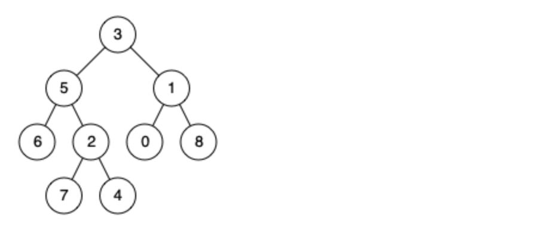

高频算法题系列：二叉树
<!--more-->

## 二叉树的最近公共祖先 
[【LeetCode 236】 二叉树的最近公共祖先（简单）](https://leetcode.cn/problems/lowest-common-ancestor-of-a-binary-tree/)

  
```js
例如，给定如上二叉树:  root = [3,5,1,6,2,0,8,null,null,7,4]
示例 1: 输入: root = [3,5,1,6,2,0,8,null,null,7,4], p = 5, q = 1 输出: 3      
解释: 节点 5 和节点 1 的最近公共祖先是节点 3。

示例 2: 输入: root = [3,5,1,6,2,0,8,null,null,7,4], p = 5, q = 4 输出: 5      
解释: 节点 5 和节点 4 的最近公共祖先是节点 5。因为根据定义最近公共祖先节点可以为节点本身。
```
如何找父指针 ？？？需要实现自底向下，怎么自底向上查找？？？

后续遍历，回溯，即可实现。可通过后续遍历的过程中，利用 Map 存储节点的父节点（ key: 节点，value：父节点）。

然后获取 p 的父节点之后在此存储起来，在遍历 q 的父节点，找 p 刚存储的。
```js
/**
* Definition for a binary tree node.
* function TreeNode(val) {
*     this.val = val;
*     this.left = this.right = null;
* }
*//**
* @param {TreeNode} root
* @param {TreeNode} p
* @param {TreeNode} q
* @return {TreeNode}
*/
let visited; let parent;
var lowestCommonAncestor = function(root, p, q) {
    visited = new Set();
    parent = new Map();
    dfs(root);
    while (p != null) {
        visited.add(p.val);
        p = parent.get(p.val);
    }
    while (q != null) {
        if (visited.has(q.val)) {
            return q;
        }
        q = parent.get(q.val);
    }
    return null;
};
function dfs(root) {
    if (root.left != null) {
        parent.set(root.left.val, root);
        dfs(root.left);
    }
    if (root.right != null) {
        parent.set(root.right.val, root);
        dfs(root.right);
    }
}
```

## 二叉搜索树中的搜索
[【LeetCode 700】 二叉搜索树中的搜索（简单）](https://leetcode.cn/problems/search-in-a-binary-search-tree/)

给定二叉搜索树（BST）的根节点 root 和一个整数值 val。
你需要在 BST 中找到节点值等于 val 的节点。 返回以该节点为根的子树。 如果节点不存在，则返回 null 。

示例 1:

输入： root = [4,2,7,1,3],  val = 2
输出： [2,1,3]

示例 2:

输入： root = [4,2,7,1,3],  val = 5
输出： []
```js
/**
* Definition for a binary tree node.
* function TreeNode(val) {
*     this.val = val;
*     this.left = this.right = null;
* }
*
* @param {TreeNode} root
* @param {number} val
* @return {TreeNode}
*/
var searchBST = function(root, val) {
    if (root == null) return null;
    if (root.val === val) return root;
    if (root.val > val) {
        return searchBST(root.left, val);
    } else if (root.val < val) {
        return searchBST(root.right, val);
    }
};
```

## 删除二叉搜索树中的节点
[【LeetCode 450】 删除二叉搜索树的节点（中等）](https://leetcode.cn/problems/delete-node-in-a-bst/)
给定一个二叉搜索树的根节点 root 和一个值 key，删除二叉搜索树中的 key 对应的节点，并保证二叉搜索树的性质不变。返回二叉搜索树（有可能被更新）的根节点的引用。
一般来说，删除节点可分为两个步骤：
首先找到需要删除的节点；
如果找到了，删除它。

示例 1:    
    
输入：root = [5,3,6,2,4,null,7], key = 3
输出：[5,4,6,2,null,null,7]      
解释：给定需要删除的节点值是 3，所以我们首先找到 3 这个节点，然后删除它。
一个正确的答案是 [5,4,6,2,null,null,7], 如下图所示。
另一个正确答案是 [5,2,6,null,4,null,7]。


示例 2:    


输入: root = [5,3,6,2,4,null,7], key = 0
输出: [5,3,6,2,4,null,7]
解释: 二叉树不包含值为 0 的节点   

示例 3:
输入: root = [], key = 0
输出: []
### 左的最右
```js
/**
* Definition for a binary tree node.
* function TreeNode(val) {
*     this.val = val;
*     this.left = this.right = null;
* }
*
* @param {TreeNode} root
* @param {number} key
* @return {TreeNode}
*/
var deleteNode = function(root, key) {
    if (root == null) return null;
    if (root.val === key) {
        if (root.left == null && root.right == null) return null;
        if (root.left == null) return root.right;
        if (root.right == null) return root.left;
        if (root.left != null && root.right != null)  {// 左的最右，或右的最左
            let target = getMinTreeMaxNode(root.left);
            root.val = target.val;
            root.left = deleteNode(root.left, target.val);
        }
    }
    if (root.val < key) {
        root.right = deleteNode(root.right, key);
    } else if (root.val > key) {
        root.left = deleteNode(root.left, key);
    }
    return root;
};
function getMinTreeMaxNode(root) {   
    if (root.right == null) return root;
    return getMinTreeMaxNode(root.right);
}
```
### 右的最左
```js
var deleteNode = function(root, key) {
    if (root == null) return null;
    if (root.val === key) {
        if (root.left == null && root.right == null) return null;
        if (root.left == null) return root.right;
        if (root.right == null) return root.left;
        if (root.left != null && root.right != null)  {
            let target = getMinTreeMaxNode(root.right);
            root.val = target.val;
            root.right = deleteNode(root.right, target.val);
        }
    }
    if (root.val < key) {
        root.right = deleteNode(root.right, key);
    } else if (root.val > key) {
        root.left = deleteNode(root.left, key);
    }
    return root;
};
function getMinTreeMaxNode(root) {
    if (root.left == null) return root;
    return getMinTreeMaxNode(root.left);
}
```

## 完全二叉树的节点个数
[【LeetCode 222】 完全二叉树的节点个数（中等）](https://leetcode-cn.com/problems/count-complete-tree-nodes/)

给你一棵 完全二叉树 的根节点 root ，求出该树的节点个数。
完全二叉树 的定义如下：在完全二叉树中，除了最底层节点可能没填满外，其余每层节点数都达到最大值，并且最下面一层的节点都集中在该层最左边的若干位置。若最底层为第 h 层，则该层包含 1~ 2^h 个节点。

示例 1：

输入：root = [1,2,3,4,5,6]
输出：6

示例 2：
输入：root = []
输出：0

示例 3：
输入：root = [1]
输出：1
   
```js
ß/**
* Definition for a binary tree node.
* function TreeNode(val) {
*     this.val = val;
*     this.left = this.right = null;
* }
*//**
* @param {TreeNode} root
* @return {number}
*/
var countNodes = function(root) {
    if (root == null) return 0;
    let l = root, r = root;
    let lh = 0, rh = 0;
    while (l != null) {
        l = l.left;
        lh++;
    }
    while (r != null) {
        r = r.right;
        rh++;
    }
    if (lh === rh) {
        return Math.pow(2, lh) - 1;
    }
    return 1 + countNodes(root.left) + countNodes(root.right);
};
```

## 二叉树的锯齿形层序遍历
[【LeetCode 103】锯齿形层序遍历（中等）](https://leetcode.cn/problems/binary-tree-zigzag-level-order-traversal/)
给你二叉树的根节点 root ，返回其节点值的 锯齿形层序遍历 。（即先从左往右，再从右往左进行下一层遍历，以此类推，层与层之间交替进行）。

示例 1：
     
输入：root = [3,9,20,null,null,15,7]
输出：[[3],[20,9],[15,7]]

示例 2：
输入：root = [1]
输出：[[1]]

示例 3：
输入：root = []
输出：[]

```js
/**
* Definition for a binary tree node.
* function TreeNode(val) {
*     this.val = val;
*     this.left = this.right = null;
* }
*//**
* @param {TreeNode} root
* @return {number[][]}
*/
let res;
var zigzagLevelOrder = function(root) {
    if (root == null) return [];
    res = [];
    BFS(root, true);
    return res;
};
function BFS(root, inOrder) {
    let resItem = []; let node;
    let stack1 = new Stack(); let stack2 = new Stack();
    *// 判断交换时机*
    let flag;
    stack1.push(root); res.push([root.val]);
    inOrder = !inOrder;
    while (!stack1.isEmpty() || !stack2.isEmpty()) {
        if (stack1.isEmpty()) flag = 'stack1';
        else if (stack2.isEmpty()) flag = 'stack2';
        *// 决定取那个栈里面的元素*
        if (flag === 'stack2' && !stack1.isEmpty()) node = stack1.pop();
        else if (flag === 'stack1' && !stack2.isEmpty()) node = stack2.pop();
        if (inOrder) {
            if (node.left) {
                if (flag === 'stack1') stack1.push(node.left);
                else stack2.push(node.left)
                resItem.push(node.left.val);
            }
            if (node.right) {
                if (flag === 'stack1') stack1.push(node.right);
                else stack2.push(node.right);
                resItem.push(node.right.val);
            }
        } else {
            if (node.right) {
                if (flag === 'stack1') stack1.push(node.right);
                else stack2.push(node.right);
                resItem.push(node.right.val);
            }
            if (node.left) {
                if (flag === 'stack1') stack1.push(node.left);
                else stack2.push(node.left);
                resItem.push(node.left.val);
            }
        }
        *// 判断下次翻转的时机*
        if ((flag === 'stack2' && stack1.isEmpty()) || (flag === 'stack1' && stack2.isEmpty())) {
            inOrder = !inOrder;
            *// 需要翻转了，就加一轮值*
            if (resItem.length > 0) res.push(resItem);
            resItem = [];
        }
    }
}
class Stack {
    constructor() {
        this.count = 0;
        this.items = [];
    }
    push(element) {
        this.items[this.count] = element;
        this.count++;
    }
    pop() {
        if (this.isEmpty()) return undefined;
        const element = this.items[this.count - 1];
        delete this.items[this.count - 1];
        this.count--;
        return element;
    }
    size() {
        return this.count;
    }
    isEmpty() {
        return this.size() === 0;
    }
}
```

