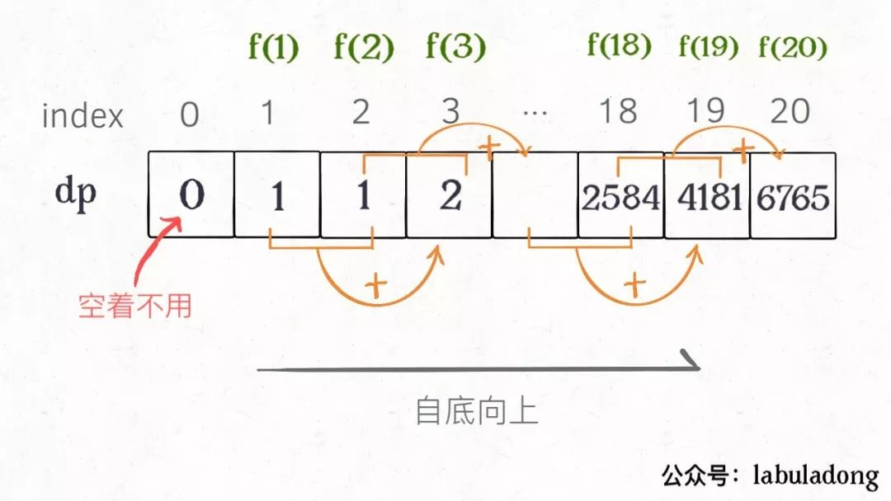
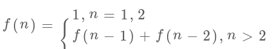
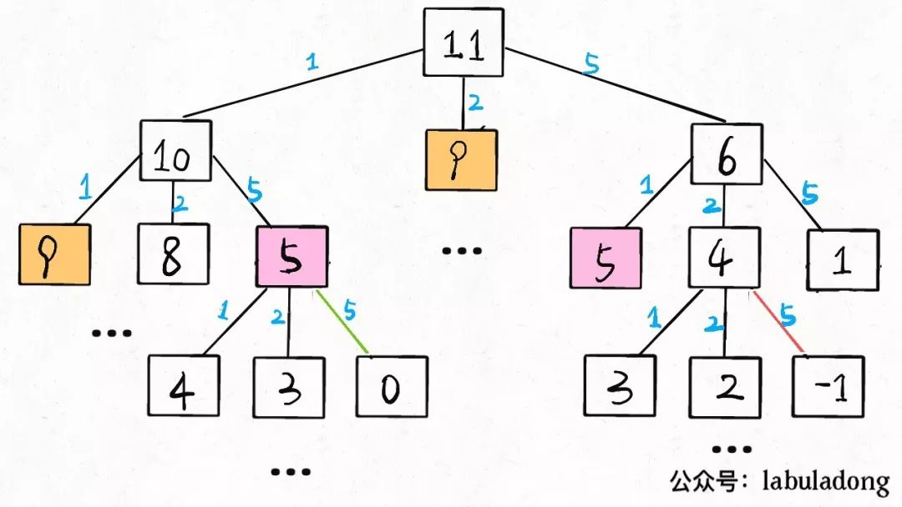
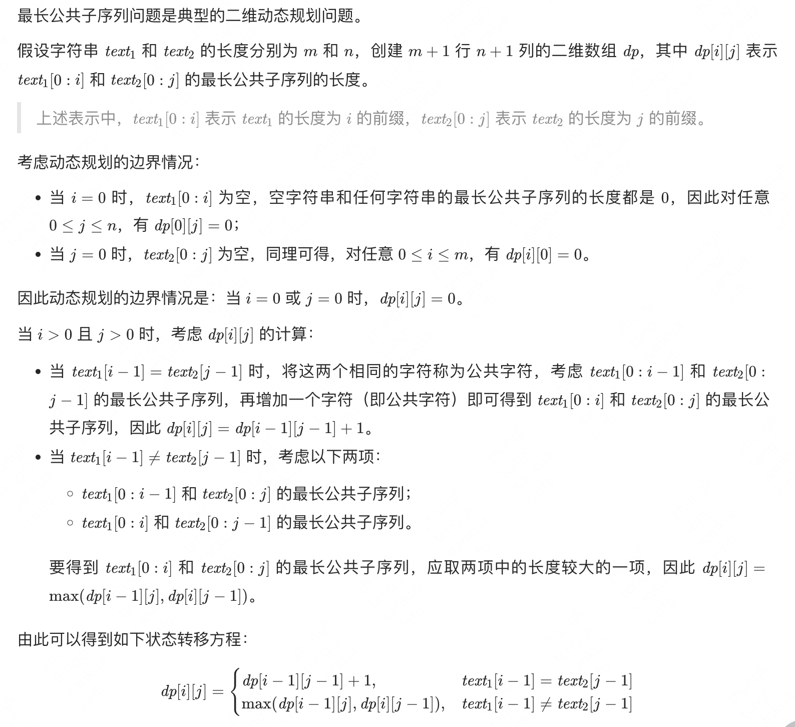

动态规划问题的一般形式就是求`最值`。动态规划其实是运筹学的一种最优化方法，只不过在计算机问题上应用比较多，比如说让你求最长递增子序列呀，最小编辑距离呀等等。
<!--more-->


本文致谢公众号 labuladong：[动态规划详解（修订版）](https://mp.weixin.qq.com/s?__biz=MzAxODQxMDM0Mw==&mid=2247484731&idx=1&sn=f1db6dee2c8e70c42240aead9fd224e6&chksm=9bd7fb33aca07225bee0b23a911c30295e0b90f393af75eca377caa4598ffb203549e1768336&scene=21#wechat_redirect)



既然是要求最值，核心问题是什么呢？求解动态规划的`核心`问题是`穷举`。因为要求最值，肯定要把所有可行的答案穷举出来，然后在其中找最值。

但是动态规划的穷举有点特别，因为这类问题存在`重叠子问题`，如果暴力穷举的话效率会极其低下，所以需要`备忘录`或者`DP table`来优化穷举过程，避免不必要的计算。

而且，动态规划问题一定会具备`最优子结构`，才能通过子问题的最值得到原问题的最值。

另外，虽然动态规划的核心思想就是穷举求最值，但是问题可以千变万化，穷举所有可行解其实并不是一件容易的事，只有列出正确的`状态转移方程`才能正确地穷举。

以上提到的`重叠子问题`、`最优子结构`、`状态转移方程`就是动态规划三要素。

在实际的算法问题中，写出状态转移方程是最困难的，这也就是为什么很多朋友觉得动态规划问题困难的原因，我来提供我研究出来的一个思维框架，辅助你思考状态转移方程：

>明确 `状态` -> 定义 dp 数组/函数的含义 -> 明确 `选择`-> 明确 `base case`。

重点关注什么是重叠子问题（斐波那契数列严格来说不是动态规划问题）、如何列出状态转移方程。


>计算机解决问题其实没有任何奇技淫巧，它唯一的解决办法就是穷举，穷举所有可能性。算法设计无非就是先思考“如何穷举”，然后再追求“如何聪明地穷举”。     
列出动态转移方程，就是在解决“如何穷举”的问题。之所以说它难，一是因为很多穷举需要递归实现，二是因为有的问题本身的解空间复杂，不那么容易穷举完整。   
备忘录、DP table 就是在追求“如何聪明地穷举”。用空间换时间的思路，是降低时间复杂度的不二法门


## 斐波那契数列
```js
写一个函数，输入 n ，求斐波那契（Fibonacci）数列的第 n 项（即 F(N)）。斐波那契数列的定义如下：

F(0) = 0,   F(1) = 1
F(N) = F(N - 1) + F(N - 2), 其中 N > 1.

斐波那契数列由 0 和 1 开始，之后的斐波那契数就是由之前的两数相加而得出。

答案需要取模 1e9+7（1000000007），如计算初始结果为：1000000008，请返回 1。

示例 1：
输入：n = 2
输出：1

示例 2：
输入：n = 5
输出：5

//斐波那契数列
// 0 1 2 3 4 5 6 7  8  9  10 11 12
// 0 1 1 2 3 5 8 13 21 34 55 89 144 233 377
```
正常的普通递归，没有问题，思路也十分简单，但是重复计算量大，很容易把电脑干爆，数据量大的时候计算缓慢，缺点明显。
```js
/**
 * @param {number} n
 * @return {number}
 */
var fib = function(n) {
    if(n<2) return n;
    return fib(n-2)+fib(n-1);
};
```

优化的思路就是想办法，减少重复计算，想办法将之前的计算过程存储一下，引入 JS Map
```js
/**
 * @param {number} n
 * @return {number}
 */
// 0 1 2 3 4 5 6 7  8  9  10 11 12
// 0 1 1 2 3 5 8 13 21 34 55 89 144 233 377
var fib = function(n) {
    if (n < 1) return 0;
    // 备忘录全初始化为 0
    let memo = new Map();
    // 初始化最简情况
    return helper(memo, n);
}
var helper = function(memo, n) {
    // base case 
    if (n == 1 || n == 2) return 1;
    // 已经计算过
    if (memo.has(n)) return memo.get(n);
    memo.set(n, helper(memo, n - 1) + helper(memo, n - 2));
    return memo.get(n)%1000000007;
}
```
有了上一步「备忘录」的启发，我们可以把这个「备忘录」独立出来成为一张表，就叫做 DP table 吧，在这张表上完成「自底向上」的推算岂不美哉！
```js
/**
 * @param {number} n
 * @return {number}
 */
var fib = function(n) {
    let dp=[];
    // base case
    dp[0]=0;
    dp[1] = dp[2] = 1;
    for (let i = 3; i <= n; i++)
        dp[i] = (dp[i - 1] + dp[i - 2])%1000000007;
    return dp[n];
};
```


画个图就很好理解了，而且你发现这个 DP table 特别像之前那个「剪枝」后的结果，只是反过来算而已。实际上，带备忘录的递归解法中的「备忘录」，最终完成后就是这个 DP table，所以说这两种解法其实是差不多的，大部分情况下，效率也基本相同。

这里，引出「状态转移方程」这个名词，实际上就是描述问题结构的数学形式：

为啥叫「状态转移方程」？为了听起来高端。你把 f(n) 想做一个状态 n，这个状态 n 是由状态 n - 1 和状态 n - 2 相加转移而来，这就叫状态转移，仅此而已。

你会发现，上面的几种解法中的所有操作，例如 return f(n - 1) + f(n - 2)，dp[i] = dp[i - 1] + dp[i - 2]，以及对备忘录或 DP table 的初始化操作，都是围绕这个方程式的不同表现形式。可见列出「状态转移方程」的重要性，它是解决问题的核心。很容易发现，其实状态转移方程直接代表着暴力解法。

千万不要看不起暴力解，动态规划问题最困难的就是写出状态转移方程，即这个暴力解。优化方法无非是用备忘录或者 DP table，再无奥妙可言。

这个例子的最后，讲一个细节优化。细心的读者会发现，根据斐波那契数列的状态转移方程，当前状态只和之前的两个状态有关，其实并不需要那么长的一个 DP table 来存储所有的状态，只要想办法存储之前的两个状态就行了。所以，可以进一步优化，把空间复杂度降为 O(1)：

```js
var fib = function(n) {
    const MOD = 1000000007;
    if (n < 2) {
        return n;
    }
    let i1 = 0, i2 = 0, i3 = 1;
    for (let i = 2; i <= n; ++i) {
        i1 = i2; 
        i2 = i3; 
        i3 = (i1 + i2) % MOD;
    }
    return r;
};
```
## 凑零钱问题

```js
给你k种面值的硬币，面值分别为c1, c2 ... ck，每种硬币的数量无限，再给一个总金额amount，问你最少需要几枚硬币凑出这个金额，
如果不可能凑出，算法返回 -1 。算法的函数签名如下：

// coins 中是可选硬币面值，amount 是目标金额
int coinChange(int[] coins, int amount);

比如说k = 3，面值分别为 1，2，5，总金额amount = 11。那么最少需要 3 枚硬币凑出，即 11 = 5 + 5 + 1。
```
### 暴力递归
首先，这个问题是动态规划问题，因为它具有「最优子结构」。要符合「最优子结构」，子问题间必须互相独立。啥叫相互独立？

比如说，你的原问题是考出最高的总成绩，那么你的子问题就是要把语文考到最高，数学考到最高…… 为了每门课考到最高，你要把每门课相应的选择题分数拿到最高，填空题分数拿到最高…… 当然，最终就是你每门课都是满分，这就是最高的总成绩。

得到了正确的结果：最高的总成绩就是总分。因为这个过程符合最优子结构，“每门科目考到最高”这些子问题是互相独立，互不干扰的。

那么，既然知道了这是个动态规划问题，就要思考如何列出正确的`状态转移方程`。

先确定 `状态`，也就是原问题和子问题中变化的变量。由于硬币数量无限，所以唯一的状态就是目标金额 `amount`。

然后确定 `dp 函数`的定义：函数 dp(n)表示，当前的目标金额是 n，至少需要 dp(n) 个硬币凑出该金额。

然后确定`选择`并择优，也就是对于每个状态，可以做出什么选择改变当前状态。

具体到这个问题，无论当的目标金额是多少，选择就是从面额列表 coins 中选择一个硬币，然后目标金额就会减少：
```js
def coinChange(coins: List[int], amount: int):

    def dp(n):
        # base case
        if n == 0: return 0
        if n < 0: return -1
        # 求最小值，所以初始化为正无穷
        res = float('INF')
        for coin in coins:
            subproblem = dp(n - coin)
            # 子问题无解，跳过
            if subproblem == -1: continue
            res = min(res, 1 + subproblem)

        return res if res != float('INF') else -1

    return dp(amount)
```
至此，状态转移方程其实已经完成了，以上算法已经是暴力解法了，以上代码的数学形式就是状态转移方程：     
至此，这个问题其实就解决了，只不过需要消除一下重叠子问题,比如amount = 11, coins = {1,2,5}时画出递归树看看：
      
`时间复杂度分析`：子问题总数 x 解决每个子问题的时间。

子问题总数为递归树节点个数，这个比较难看出来，是 O(n^k)，总之是指数级别的。每个子问题中含有一个 for 循环，复杂度为 O(k)。所以总时间复杂度为 O(k * n^k)，指数级别。

### 带备忘录的递归

只需要稍加修改，就可以通过备忘录消除子问题：
```js
def coinChange(coins: List[int], amount: int):
    # 备忘录
    memo = dict()
    def dp(n):
        # 查备忘录，避免重复计算
        if n in memo: return memo[n]

        if n == 0: return 0
        if n < 0: return -1
        res = float('INF')
        for coin in coins:
            subproblem = dp(n - coin)
            if subproblem == -1: continue
            res = min(res, 1 + subproblem)

        # 记入备忘录
        memo[n] = res if res != float('INF') else -1
        return memo[n]

    return dp(amount)
```
显然「备忘录」大大减小了子问题数目，完全消除了子问题的冗余，所以子问题总数不会超过金额数 n，即子问题数目为 O(n)。
处理一个子问题的时间不变，仍是 O(k)，所以总的时间复杂度是 O(kn)。

### dp 数组

当然，我们也可以自底向上使用 `dp table` 来消除重叠子问题，dp 数组的定义和刚才 dp 函数类似，定义也是一样的：

`dp[i] = x` 表示，当目标金额为 i 时，至少需要 x 枚硬币。
```js
int coinChange(vector<int>& coins, int amount) {
    // 数组大小为 amount + 1，初始值也为 amount + 1
    vector<int> dp(amount + 1, amount + 1);
    // base case
    dp[0] = 0;
    for (int i = 0; i < dp.size(); i++) {
        // 内层 for 在求所有子问题 + 1 的最小值
        for (int coin : coins) {
            // 子问题无解，跳过
            if (i - coin < 0) continue;
            dp[i] = min(dp[i], 1 + dp[i - coin]);
        }
    }
    return (dp[amount] == amount + 1) ? -1 : dp[amount];
}
```

PS：为啥dp数组初始化为amount + 1呢，因为凑成amount金额的硬币数最多只可能等于amount（全用 1 元面值的硬币），所以初始化为amount + 1就相当于初始化为正无穷，便于后续取最小值。
   
### JS 版
[【LeetCode 322】 零钱兑换（中等）](https://leetcode.cn/problems/coin-change/)
```js
给你一个整数数组 coins ，表示不同面额的硬币；以及一个整数 amount ，表示总金额。

计算并返回可以凑成总金额所需的 最少的硬币个数 。如果没有任何一种硬币组合能组成总金额，返回 -1 。

你可以认为每种硬币的数量是无限的。

示例 1：
输入：coins = [1, 2, 5], amount = 11
输出：3 
解释：11 = 5 + 5 + 1

示例 2：
输入：coins = [2], amount = 3
输出：-1

示例 3：
输入：coins = [1], amount = 0
输出：0
```
```cpp
/**
* @param {number[]} coins
* @param {number} amount
* @return {number}
*/
var coinChange = function(coins, amount) {
        if (amount === 0) return 0;
        let dp = [];
        for (let i = 0; i <= amount; i++) {
            dp[i] = amount + 1;
        }
        dp[0] = 0;
        for (let i = 0; i <= amount; i++) {
            for (let j = 0; j < coins.length; j++) {
                if (i >= coins[j]) { 1>=1 2>=1
                            // dp[1]=1 dp[2]=1 dp[5]=1 
                    dp[i] = Math.min(dp[i - coins[j]] + 1, dp[i])
                }
            }
        }
        return dp[amount] === amount + 1 ? -1 : dp[amount];
};
```

## 最长递增子序列
[【LeetCode 300】 最长递增子序列（中等）](https://leetcode-cn.com/problems/longest-increasing-subsequence/)

```js
给你一个整数数组 nums ，找到其中最长严格递增子序列的长度。

子序列 是由数组派生而来的序列，删除（或不删除）数组中的元素而不改变其余元素的顺序。例如，[3,6,2,7] 是数组 [0,3,1,6,2,2,7] 的子序列。

示例 1：
输入：nums = [10,9,2,5,3,7,101,18]
输出：4
解释：最长递增子序列是 [2,3,7,101]，因此长度为 4 。

示例 2：
输入：nums = [0,1,0,3,2,3]
输出：4

示例 3：
输入：nums = [7,7,7,7,7,7,7]
输出：1
```
没有说是否连续。拆分为 到 `第 n 个` 元素的最长递增序列，分别求解，第 `n+1` 个即为 前 `n` 个中小于 `num[n]` 中的最大的 `+1` 。
```js
/**
 * @param {number[]} nums
 * @return {number}
 */
var lengthOfLIS = function(nums) {
    let dp = [];
    for(let i=0;i<nums.length;i++){
        dp[i]=1;
    }
    let res = 1;
    for(let i=0;i<nums.length;i++){
        for(let j=i;j>=0;j--){
            if(nums[i] > nums[j]){
                dp[i] = Math.max(dp[j]+1,dp[i]);
            }
        }
        res = Math.max(dp[i],res);
    }  
    return res;
};
```

## 最长公共子序列
[【LeetCode 1143】 最长公共子序列（中等）](https://leetcode.cn/problems/longest-common-subsequence/)
```js
给定两个字符串 text1 和 text2，返回这两个字符串的最长 公共子序列 的长度。如果不存在 公共子序列 ，返回 0 。
一个字符串的 子序列 是指这样一个新的字符串：它是由原字符串在不改变字符的相对顺序的情况下删除某些字符（也可以不删除任何字符）后组成的新字符串。

例如，"ace" 是 "abcde" 的子序列，但 "aec" 不是 "abcde" 的子序列。
两个字符串的 公共子序列 是这两个字符串所共同拥有的子序列。

示例 1：
输入：text1 = "abcde", text2 = "ace" 
输出：3  
解释：最长公共子序列是 "ace" ，它的长度为 3 。

示例 2：
输入：text1 = "abc", text2 = "abc"
输出：3
解释：最长公共子序列是 "abc" ，它的长度为 3 。

示例 3：
输入：text1 = "abc", text2 = "def"
输出：0
解释：两个字符串没有公共子序列，返回 0 。
```

```js
/**
* @param {string} text1
* @param {string} text2
* @return {number}
*/
var longestCommonSubsequence = function(text1, text2) {
    const m = text1.length, n = text2.length;
    const dp = new Array(m + 1).fill(0).map(() => new Array(n + 1).fill(0));
    for (let i = 1; i <= m; i++) {
        const c1 = text1[i - 1];
        for (let j = 1; j <= n; j++) {
            const c2 = text2[j - 1];
            if (c1 === c2) {
                dp[i][j] = dp[i - 1][j - 1] + 1;
            } else {
                dp[i][j] = Math.max(dp[i - 1][j], dp[i][j - 1]);
            }
        }
    }
    return dp[m][n];
};
```

## 编辑距离
[【LeetCode 直通车】：72 编辑距离（困难）](https://leetcode.cn/problems/edit-distance/)

```js
给你两个单词 word1 和 word2， 请返回将 word1 转换成 word2 所使用的最少操作数。你可以对一个单词进行如下三种操作：
插入一个字符
删除一个字符
替换一个字符
 
示例 1：
输入：word1 = "horse", word2 = "ros"
输出：3
解释：
horse -> rorse (将 'h' 替换为 'r')
rorse -> rose (删除 'r')
rose -> ros (删除 'e')

示例 2：
输入：word1 = "intention", word2 = "execution"
输出：5
解释：
intention -> inention (删除 't')
inention -> enention (将 'i' 替换为 'e')
enention -> exention (将 'n' 替换为 'x')
exention -> exection (将 'n' 替换为 'c')
exection -> execution (插入 'u')
```
首先分析可以进行的操作，A 插入、删除、替换、B 插入、删除、替换，共六种。    
再细看，A 插入等价于 B 删除，A 删除等价于 B 插入，A 替换等价于 B 替换，实际共三种。 

1. **A 插入一个**：如果我们知道 horse 到 ro 的编辑距离为 a，那么显然 horse 到 ros 的编辑距离不会超过 a + 1。这是因为我们可以在 a 次操作后将 horse 和 ro 变为相同的字符串，只需要额外的 1 次操作，在单词 A 的末尾添加字符 s，就能在 a + 1 次操作后将 horse 和 ro 变为相同的字符串；

2. **B 中插入一个**：如果我们知道 hors 到 ros 的编辑距离为 b，那么显然 horse 到 ros 的编辑距离不会超过 b + 1，原因同上；

3. **修改 A 一个**：如果我们知道 hors 到 ro 的编辑距离为 c，那么显然 horse 到 ros 的编辑距离不会超过 c + 1，原因同上。

那么从 horse 变成 ros 的编辑距离应该为 `min(a + 1, b + 1, c + 1)`。**将原来问题的答案转换为许多子问题的答案**。

用 `D[i][j]` 表示 A 的前 `i` 个字母和 B 的前 `j` 个字母之间的编辑距离。

可得其状态转移方程为 `D[i][j]=1+min(D[i][j−1],D[i−1][j],D[i−1][j−1])`
如果最后一个字母相等，那么 D[i][j] = D[i-1][j-1]。此时状态方程为: `1+min(D[i][j−1],D[i−1][j],D[i−1][j−1]−1)`

对于边界情况：对于边界情况，一个空串和一个非空串的编辑距离为 D[i][0] = i 和 D[0][j] = j，D[i][0] 相当于对 word1 执行 i 次删除操作，D[0][j] 相当于对 word1执行 j 次插入操作。
```js
/**
* @param {string} word1
* @param {string} word2
* @return {number}
*/
var minDistance = function(word1, word2) {
    let len1 = word1.length, len2 = word2.length;
    let dp = [];
    // dp 数组初始化
    for (let i = 0; i <= len1; i++) {
        dp[i] = [];
        for (let j = 0; j <= len2; j++) {
            dp[i][j] = 0;
            if (i === 0) {
                dp[i][j] = j;
            }
            if (j === 0) {
                dp[i][j] = i;
            }
        }
    }
    // dp 数组填充值
    for (let i = 1; i <= len1; i++) {
        for (let j = 1; j <= len2; j++) {
            if (word1[i - 1] === word2[j - 1]) {
                dp[i][j] = dp[i - 1][j - 1];
            } else {
                dp[i][j] = 1 + Math.min(dp[i - 1][j], dp[i][j - 1], dp[i - 1][j - 1]);
            }
        }
    }
    // return 值
    return dp[len1][len2];
};
```

## 最长回文子序列
[【LeetCode 516】最长回文子序列（中等）](https://leetcode.cn/problems/longest-palindromic-subsequence/)
```js
给你一个字符串 s ，找出其中最长的回文子序列，并返回该序列的长度。
子序列定义为：不改变剩余字符顺序的情况下，删除某些字符或者不删除任何字符形成的一个序列。

示例 1：
输入：s = "bbbab"
输出：4
解释：一个可能的最长回文子序列为 "bbbb" 。

示例 2：
输入：s = "cbbd"
输出：2
解释：一个可能的最长回文子序列为 "bb" 。
```
对于一个子序列而言，如果它是回文子序列，并且长度大于 2，那么将它首尾的两个字符去除之后，它仍然是个回文子序列。因此可以用动态规划的方法计算给定字符串的最长回文子序列。

用 `dp[i][j]` 表示字符串 s 的下标范围 `[i, j]` 内的最长回文子序列的长度。假设字符串 s 的长度为 n，则只有当 `0 ≤ i ≤ j < n` 时，才会有 `dp[i][j]> 0`，否则 `dp[i][j]=0`。

由于任何长度为 1 的子序列都是回文子序列，因此动态规划的边界情况是，对任意 `0 ≤ i < n`，都有 `dp[i][i] = 1`。

当 `i < j` 时，计算 `dp[i][j]` 需要分别考虑 `s[i]` 和 `s[j]` 相等和不相等的情况：

如果 `s[i]=s[j]`，则首先得到 s 的下标范围 `[i+1,j−1]` 内的最长回文子序列，然后在该子序列的首尾分别添加 `s[i]` 和 `s[j]`，即可得到 s 的下标范围 `[i, j]`内的最长回文子序列，因此 `dp[i][j] = dp[i+1][j−1] + 2`；

如果 `s[i] != s[i]` ，则 `s[i]` 和 `s[j]` 不可能同时作为同一个回文子序列的首尾，因此 `dp[i][j] = max(dp[i+1][j], dp[i][j−1])`。

由于状态转移方程都是从长度较短的子序列向长度较长的子序列转移，因此需要注意动态规划的循环顺序。

最终得到 `dp[0][n−1]` 即为字符串 s 的最长回文子序列的长度。
```js
/**
* @param {string}
* @return {number}
*/
var longestPalindromeSubseq = function(s) {
    let dp = [];
    for (let i = 0; i < s.length; i++) {
        dp[i] = [];
        for (let j = 0; j < s.length; j++) {
            dp[i][j] = 0;
        }
        dp[i][i] = 1;
    }
    for (let i = s.length - 1; i >= 0; i--) {
        for (let j = i + 1; j < s.length; j++) {
            if (s[i] === s[j]) {
                dp[i][j] = dp[i + 1][j - 1] + 2;
            } else {
                dp[i][j] = Math.max(dp[i + 1][j], dp[i][j - 1]);
            }
        }
    }
    return dp[0][s.length - 1];
};
```

##  最大子序和
[【LeetCode 53】最大子序和（简单）](https://leetcode.cn/problems/maximum-subarray/)
```js
给你一个整数数组 nums ，请你找出一个具有最大和的连续子数组（子数组最少包含一个元素），返回其最大和。
子数组 是数组中的一个连续部分。

示例 1：
输入：nums = [-2,1,-3,4,-1,2,1,-5,4]
输出：6
解释：连续子数组 [4,-1,2,1] 的和最大，为 6 。

示例 2：
输入：nums = [1]
输出：1

示例 3：
输入：nums = [5,4,-1,7,8]
输出：23
```
重点：dp[i] 表示到 i 为止，前面的最大的子数组的和。有： `dp[i] = Math.max(nums[i], dp[i - 1] + nums[i]);`
```js
/**
* @param {number[]} nums
* @return {number}
*/
var maxSubArray = function(nums) {
    let maxSum = -Infinity;
    let dp = [], n = nums.length;
    for (let i = -1; i < n; i++) {
        dp[i] = 0;
    }
    for (let i = 0; i < n; i++) {
        dp[i] = Math.max(nums[i], dp[i - 1] + nums[i]);
        maxSum = Math.max(maxSum, dp[i]);
    }
    return maxSum;
};

var maxSubArray = function(nums) {
    let n = nums.length;
    let dp = [];
    for(let i=0; i<n; i++){
        dp[i] = 0;
    }
    dp[0] = nums[0];
    let res = dp[0];
    for(let i=1;i<n;i++){
        dp[i] = Math.max(dp[i-1]+nums[i], nums[i]);
        res = Math.max(res,dp[i]);
    }
    return res;
};
```
## 买卖股票的最佳时机
[【LeetCode 直通车】：121 买卖股票的最佳时机（简单）](https://leetcode.cn/problems/best-time-to-buy-and-sell-stock/)
```js
给定一个数组 prices ，它的第 i 个元素 prices[i] 表示一支给定股票第 i 天的价格。
你只能选择 某一天 买入这只股票，并选择在 未来的某一个不同的日子 卖出该股票。设计一个算法来计算你所能获取的最大利润。
返回你可以从这笔交易中获取的最大利润。如果你不能获取任何利润，返回 0 。

示例 1：
输入：[7,1,5,3,6,4]
输出：5
解释：在第 2 天（股票价格 = 1）的时候买入，在第 5 天（股票价格 = 6）的时候卖出，最大利润 = 6-1 = 5 。
    注意利润不能是 7-1 = 6, 因为卖出价格需要大于买入价格；同时，你不能在买入前卖出股票。
示例 2：

输入：prices = [7,6,4,3,1]
输出：0
解释：在这种情况下, 没有交易完成, 所以最大利润为 0。
```
### 暴力循环
双层遍历可解，但是会超时，时间复杂度为 O(n^2);

### 单层遍历
```js
/**
 * @param {number[]} prices
 * @return {number}
 */
var maxProfit = function(prices) {
    let min = Infinity, max = 0;
    for (let price of prices) {
        max = Math.max(max, price - min);
        min = Math.min(price, min);
    }
    return max;
};
```
### DP
```js
/**
 * @param {number[]} prices
 * @return {number}
 */
var maxProfit = function(prices) {
    let n = prices.length,dp=[];
    if (n == 0) return 0; // 边界条件
    let minprice = prices[0];

    for(let i=-1;i<n;i++){
        dp[i]=0;
    }

    for (let i = 1; i < n; i++){
        minprice = Math.min(minprice, prices[i]);
        dp[i] = Math.max(dp[i - 1], prices[i] - minprice);
    }
    return dp[n - 1];
};
```

## 买卖股票的最佳时机 II
[【LeetCode 直通车】：122 买卖股票的最佳时机 II（中等）](https://leetcode.cn/problems/best-time-to-buy-and-sell-stock-ii/)
```js
给你一个整数数组 prices ，其中 prices[i] 表示某支股票第 i 天的价格。
在每一天，你可以决定是否购买和/或出售股票。你在任何时候最多只能持有 一股 股票。你也可以先购买，然后在 同一天 出售。
返回 你能获得的 最大 利润 。

示例 1：
输入：prices = [7,1,5,3,6,4]
输出：7
解释：在第 2 天（股票价格 = 1）的时候买入，在第 3 天（股票价格 = 5）的时候卖出, 这笔交易所能获得利润 = 5 - 1 = 4 。
    随后，在第 4 天（股票价格 = 3）的时候买入，在第 5 天（股票价格 = 6）的时候卖出, 这笔交易所能获得利润 = 6 - 3 = 3 。
    总利润为 4 + 3 = 7 。

示例 2：
输入：prices = [1,2,3,4,5]
输出：4
解释：在第 1 天（股票价格 = 1）的时候买入，在第 5 天 （股票价格 = 5）的时候卖出, 这笔交易所能获得利润 = 5 - 1 = 4 。
     总利润为 4 。

示例 3：
输入：prices = [7,6,4,3,1]
输出：0
解释：在这种情况下, 交易无法获得正利润，所以不参与交易可以获得最大利润，最大利润为 0 。
```
定义状态`dp[i][0]` 表示第 i 天交易完后手里没有股票的最大利润，`dp[i][1]` 表示第 i 天交易完后手里持有一支股票的最大利润（i 从 0 开始）。

考虑 `dp[i][0]` 的转移方程，如果这一天交易完后手里没有股票，那么可能的转移状态为前一天已经没有股票，即 `dp[i−1][0]`，或者前一天结束的时候手里持有一支股票，即 `dp[i−1][1]`，这时候我们要将其卖出，并获得 `prices[i]` 的收益。因此为了收益最大化，我们列出如下的转移方程：
`dp[i][0]=max{dp[i−1][0],dp[i−1][1]+prices[i]}`

再来考虑 `dp[i][1]`，按照同样的方式考虑转移状态，那么可能的转移状态为前一天已经持有一支股票，即 `dp[i−1][1]`，或者前一天结束时还没有股票，即 `dp[i−1][0]`，这时候我们要将其买入，并减少 `prices[i]` 的收益。可以列出如下的转移方程：
`dp[i][1]=max{dp[i−1][1],dp[i−1][0]−prices[i]}`

对于初始状态，根据状态定义我们可以知道第 0 天交易结束的时候 dp[0][0]=0，dp[0][1]=−prices[0]。

因此，我们只要从前往后依次计算状态即可。由于全部交易结束后，持有股票的收益一定低于不持有股票的收益，因此这时候 dp[n−1][0] 的收益必然是大于 dp[n−1][1] 的，最后的答案即为 dp[n−1][0]。
```js
/**
 * @param {number[]} prices
 * @return {number}
 */
var maxProfit = function(prices) {
    const n = prices.length;
    const dp = new Array(n).fill(0).map(v => new Array(2).fill(0));
    console.log(dp);
    dp[0][0] = 0, dp[0][1] = -prices[0];
    for (let i = 1; i < n; ++i) {
        dp[i][0] = Math.max(dp[i - 1][0], dp[i - 1][1] + prices[i]);
        dp[i][1] = Math.max(dp[i - 1][1], dp[i - 1][0] - prices[i]);
    }
    console.log(dp);
    return dp[n - 1][0];
};
```
## 买卖股票的最佳时机 III
• 👉 [【LeetCode 直通车】：123 买卖股票的最佳时机 III（困难）](https://link.juejin.cn/?target=https%3A%2F%2Fleetcode-cn.com%2Fproblems%2Fbest-time-to-buy-and-sell-stock-iii%2F)
## 买卖股票的最佳时机IV
• 👉 [【LeetCode 直通车】：188 买卖股票的最佳时机IV（困难）](https://link.juejin.cn/?target=https%3A%2F%2Fleetcode-cn.com%2Fproblems%2Fcontainer-with-most-water%2F)
## 买卖股票的最佳时机含冷冻期
• 👉 [【LeetCode 直通车】：309 买卖股票的最佳时机含冷冻期（中等）](https://link.juejin.cn/?target=https%3A%2F%2Fleetcode-cn.com%2Fproblems%2Fbest-time-to-buy-and-sell-stock-with-cooldown%2F)
## 买卖股票的最佳时机含手续费
• 👉 [【LeetCode 直通车】：714 买卖股票的最佳时机含手续费（中等）](https://link.juejin.cn/?target=https%3A%2F%2Fleetcode-cn.com%2Fproblems%2Fbest-time-to-buy-and-sell-stock-with-transaction-fee%2F)


