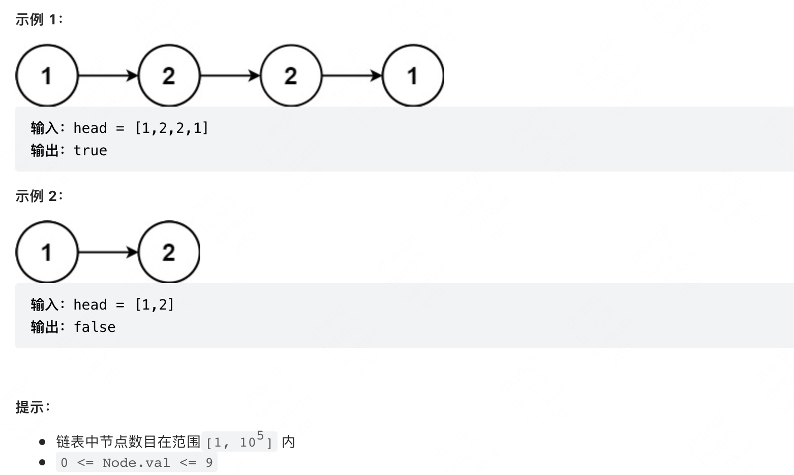

本文中介绍些链表相关的高频算法题，LeetCode 实战分享。
<!--more-->
## 前序遍历判断回文链表
👉 [【LeetCode 直通车】：234 回文链表（简单）](https://link.juejin.cn/?target=https%3A%2F%2Fleetcode-cn.com%2Fproblems%2Fpalindrome-linked-list%2F)     
给你一个单链表的头节点 head ，请你判断该链表是否为回文链表。如果是，返回 true ；否则，返回 false 。     



### 后续遍历
利用链表的后续遍历，使用函数调用栈作为后序遍历栈，来判断是否回文

```js
/**
* Definition for singly-linked list.
* function ListNode(val, next) {
*     this.val = (val===undefined ? 0 : val)
*     this.next = (next===undefined ? null : next)
* }
*/

/**
 * @param {ListNode} head
 * @return {boolean}
 */

let left ;
var isPalindrome = function(head) {
    left = head;
    return traverse(head);
};

function traverse(right) {
    if (right == null) return true;
    let res = traverse(right.next);
    res = res && (right.val === left.val);
    left = left.next;
    return res;
}
```

### 快慢指针

通过 快、慢指针找链表中点，然后反转链表，比较两个链表两侧是否相等，来判断是否是回文链表

```js
var isPalindrome = function(head) {
    // 反转 slower 链表
	let right = reverse(findCenter(head));
    let left = head;
    // 开始比较
		while (right != null) {
        if (left.val !== right.val) {
            return false;
        }
        left = left.next;
        right = right.next;
    }
    return true;
}
function findCenter(head) {
    let slower = head, faster = head;
    while (faster && faster.next != null) {
        slower = slower.next;
        faster = faster.next.next;
    }
    // 如果 faster 不等于 null，说明是奇数个，slower 再移动一格
    if (faster != null) {
        slower = slower.next;
    }
    return slower;
}
function reverse(head) {
    let prev = null, cur = head, nxt = head;
    while (cur != null) {
        nxt = cur.next;
        cur.next = prev;
        prev = cur;
        cur = nxt;
    }
    return prev;
}
```

## 反转链表
 [【LeetCode 直通车】：206 反转链表（简单）](https://link.juejin.cn/?target=https%3A%2F%2Fleetcode-cn.com%2Fproblems%2Freverse-linked-list%2F)
    
### 递归反转
```js
/**
    * Definition for singly-linked list.
    * function ListNode(val) {
    *     this.val = val;
    *     this.next = null;
    * }
    *//**
    * @param {ListNode} head
    * @return {ListNode}
    */*
var reverseList = function(head) {
    if (head == null || head.next == null) return head;
    let last = reverseList(head.next);
    head.next.next = head;
    head.next = null;
    return last;
};
```
### 三个指针
```js
var reverseList = function(head) {
    let prev = null, cur = head, nxt = head;
    while (cur != null) {
        nxt = cur.next;
        cur.next = prev;
        prev = cur;
        cur = nxt;
    }
    return prev;
};
```