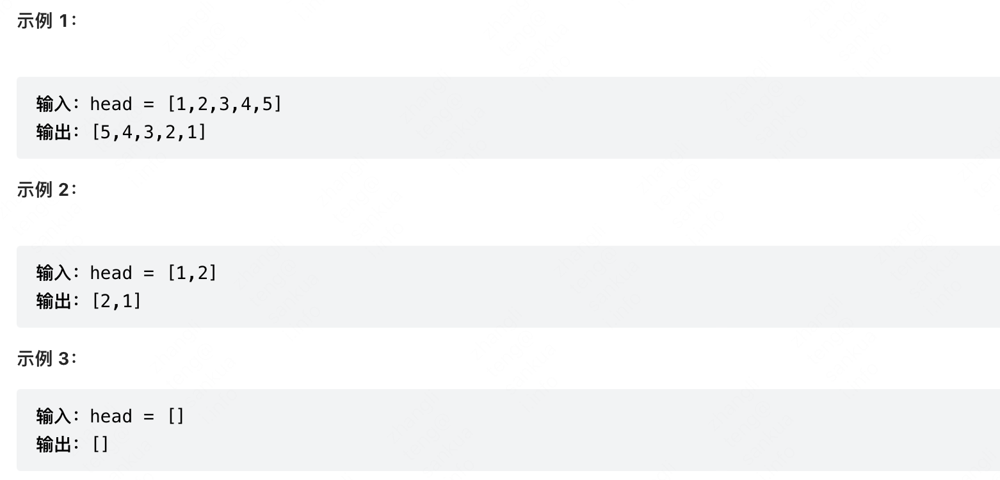
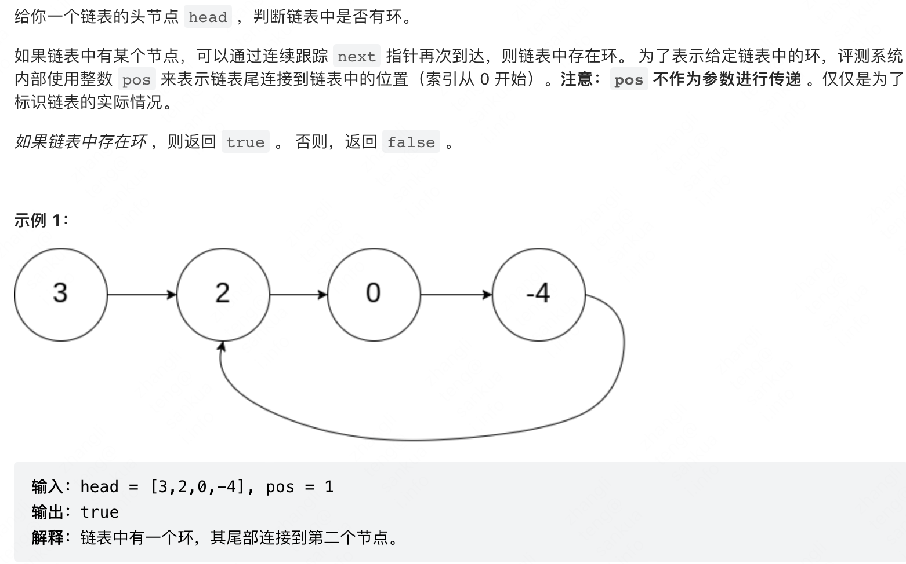
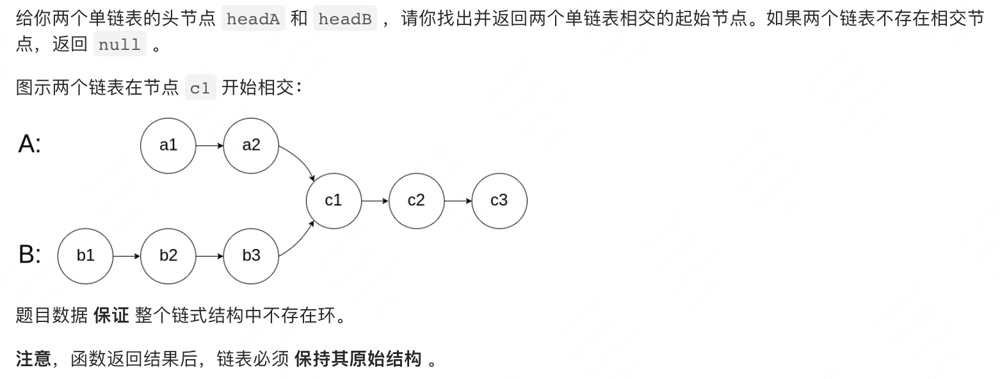

# 链表那个链


本文中介绍些链表相关的高频算法题，LeetCode 实战分享。
<!--more-->
## 回文链表
👉 [【LeetCode 直通车】：234 回文链表（简单）](https://link.juejin.cn/?target=https%3A%2F%2Fleetcode-cn.com%2Fproblems%2Fpalindrome-linked-list%2F)     
给你一个单链表的头节点 head ，请你判断该链表是否为回文链表。如果是，返回 true ；否则，返回 false 。     


### 递归遍历
利用链表的后续遍历，使用函数调用栈作为后序遍历栈，来判断是否回文。

递归到最后之后，最后一个跟头节点比较，然后递归回退一个，头节点往下走，依次实现，第几个和倒数第几个实现一个比较。

```js

let left ;
var isPalindrome = function(head) {
    left = head;
    return traverse(head);
};

function traverse(right) {
    if (right == null) return true;
    let res = traverse(right.next);
    res = res && (right.val === left.val);
    left = left.next;
    return res;
}
```

### 快慢指针

通过 快、慢指针找链表中点，然后反转链表，比较两个链表两侧是否相等，来判断是否是回文链表

```js
var isPalindrome = function(head) {
    // 反转 slower 链表
	let right = reverse(findCenter(head));
    let left = head;
    // 开始比较
	while (right != null) {
        if (left.val !== right.val) {
            return false;
        }
        left = left.next;
        right = right.next;
    }
    return true;
}
function findCenter(head) {
    let slower = head, faster = head;
    while (faster && faster.next != null) {
        slower = slower.next;
        faster = faster.next.next;
    }
    // 如果 faster 不等于 null，说明是奇数个，slower 再移动一格
    if (faster != null) {
        slower = slower.next;
    }
    return slower;
}
function reverse(head) {
    let prev = null, cur = head, nxt = head;
    while (cur != null) {
        nxt = cur.next;
        cur.next = prev;
        prev = cur;
        cur = nxt;
    }
    return prev;
}
```

## 反转链表
 [【LeetCode 直通车】：206 反转链表（简单）](https://leetcode.cn/problems/reverse-linked-list/) 给你单链表的头节点 Head，请你反转链表，并返回反转后的链表。
       
### 递归反转    
利用递归走到最后一个之后，让最后一个成为第一个。断开最后一个和倒数第二个的连接，return 最后一个，此时得到的应该是就是最后一个变成头的链表。   
利用递归的特性，再依次使得倒数第二个变成头，倒数第三个变成头，倒数...... 即可。
```js
var reverseList = function(head) {
    if (head == null || head.next == null) return head;
    let last = reverseList(head.next);
    head.next.next = head;
    head.next = null;
    return last;
};
```
### 三个指针
当前节点，前一个节点，后一个节点，三个指针完成链表的反转，并依次移动。          

```js
var reverseList = function(head) {
    let prev = null, cur = head, nxt = head;
    while (cur != null) {
        nxt = cur.next;    // 往后走
        cur.next = prev;   // 更新连接  
        prev = cur;        // 往前走
        cur = nxt;         // 往前走
    }
    return prev;
};
```

  
## 合并K个升序链表
[【LeetCode 直通车】：23 合并K个升序链表（困难）](https://leetcode.cn/problems/merge-k-sorted-lists/)    

给你一个链表数组，每个链表都已经按升序排列。请你将所有链表合并到一个升序链表中，返回合并后的链表。


```js
示例 1：
输入：lists = [[1,4,5],[1,3,4],[2,6]]
输出：[1,1,2,3,4,4,5,6]
解释：链表数组如下：
[
  1->4->5,
  1->3->4,
  2->6
]
将它们合并到一个有序链表中得到。
1->1->2->3->4->4->5->6
```   
### 归并排序思想

```js
var mergeKLists = function(lists) {
    if (lists.length === 0) return null;
    return mergeArr(lists);
};
function mergeArr(lists) {
    if (lists.length <= 1) return lists[0];
    let index = Math.floor(lists.length / 2);
    const left = mergeArr(lists.slice(0, index))
    const right = mergeArr(lists.slice(index));
    return merge(left, right);
}
function merge(l1, l2) {
    if (l1 == null && l2 == null) return null;
    if (l1 != null && l2 == null) return l1;
    if (l1 == null && l2 != null) return l2;
    let newHead = null, head = null;
    while (l1 != null && l2 != null) {
        if (l1.val < l2.val) {
            if (!head) {
                newHead = l1;
                head = l1;
            } else {
                newHead.next = l1;
                newHead = newHead.next;
            }
            l1 = l1.next;
        } else {
            if (!head) {
                newHead = l2;
                head = l2;
            } else {
                newHead.next = l2;
                newHead = newHead.next;
            }
            l2 = l2.next;
        }
    }
    newHead.next = l1 ? l1 : l2;
    return head;
}
```

## K 个一组翻转链表
[【LeetCode 直通车】：25 K 个一组翻转链表（困难）](https://leetcode.cn/problems/reverse-nodes-in-k-group/)

给你链表的头节点 head ，每 k 个节点一组进行翻转，请你返回修改后的链表。

k 是一个正整数，它的值小于或等于链表的长度。如果节点总数不是 k 的整数倍，那么请将最后剩余的节点保持原有顺序。

你不能只是单纯的改变节点内部的值，而是需要实际进行节点交换。

```js
示例 1：
输入：head = [1,2,3,4,5], k = 2
输出：[2,1,4,3,5]
```


```js
示例 2：
输入：head = [1,2,3,4,5], k = 3
输出：[3,2,1,4,5]   
```


### 分批来

```js
/**
* Definition for singly-linked list.
* function ListNode(val) {
*     this.val = val;
*     this.next = null;
* }
*//**
* @param {ListNode} head
* @param {number} k
* @return {ListNode}
*/
var reverseKGroup = function(head, k) {
    let a = head, b = head;
    for (let i = 0; i < k; i++) {
        if (b == null) return head;
        b = b.next;
    }
    const newHead = reverse(a, b);
    a.next = reverseKGroup(b, k);
    return newHead;
};
function reverse(a, b) {
    let prev = null, cur = a, nxt = a;
    while (cur != b) {
        nxt = cur.next;
        cur.next = prev;
        prev = cur;
        cur = nxt;
    }
    return prev;
}
```

## 环形链表 
[【LeetCode 直通车】：141 环形链表（简单）](https://leetcode-cn.com/problems/linked-list-cycle)



### 快慢指针
```js
/**
    * Definition for singly-linked list.
    * function ListNode(val) {
    *     this.val = val;
    *     this.next = null;
    * }
    *//**
    * @param {ListNode} head
    * @return {boolean}
*/
var hasCycle = function(head) {
    if (head == null || head.next == null) return false;
    let slower = head, faster = head;
    while (faster != null && faster.next != null) {
        slower = slower.next;
        faster = faster.next.next;
        if (slower === faster) return true;
    }
    return false;
};
```

## 排序链表
 [【LeetCode 直通车】：148 排序链表（中等）](https://leetcode-cn.com/problems/sort-list)

给你链表的头节点，请你将其按照 `升序` 排序后，返回。


```js
var sortList = function(head) {
    if (head == null) return null;
    let newHead = head;
    return mergeSort(head);
};
function mergeSort(head) {
    if (head.next != null) {
        let slower = getCenter(head);
        let nxt = slower.next;
        slower.next = null;
        console.log(head, slower, nxt);
        const left = mergeSort(head);
        const right = mergeSort(nxt);
        head = merge(left, right);
    }
    return head;
}
function merge(left, right) {
    let newHead = null, head = null;
    while (left != null && right != null) {
        if (left.val < right.val) {
            if (!head) {
                newHead = left;
                head = left;
            } else {
                newHead.next = left;
                newHead = newHead.next;
            }
            left = left.next;
        } else {
            if (!head) {
                newHead = right;
                head = right;
            } else {
                newHead.next = right;
                newHead = newHead.next;
            }
            right = right.next;
        }
    }
    newHead.next = left ? left : right;
    return head;
}
function getCenter(head) {
    let slower = head, faster = head.next;
    while (faster != null && faster.next != null) {
        slower = slower.next;
        faster = faster.next.next;
    }
    return slower;
}
```
    
## 相交链表
[【LeetCode 直通车】：160 相交链表（简单）](https://leetcode-cn.com/problems/intersection-of-two-linked-lists)
    

    
两个链表以步伐一，开始跑，跑到底就再从另个一头节点开始跑。
如果两个链表相交，那么终会在某节点相等。
```js
var getIntersectionNode = function(headA, headB) {
    let lastHeadA = null;
    let lastHeadB = null;
    let originHeadA = headA;
    let originHeadB = headB;
    if (!headA || !headB) {
        return null;
    }
    while (true) {
        if (headB == headA) {
            return headB;
        }

        if (headA && headA.next == null) {
            lastHeadA = headA;
            headA = originHeadB;
        } else {
            headA = headA.next;
        }

        if (headB && headB.next == null) {
            lastHeadB = headB
            headB = originHeadA;
        } else {
            headB = headB.next;
        }

        if (lastHeadA && lastHeadB && lastHeadA != lastHeadB) {
            return null;
        }
    }
    return null;
};
```
